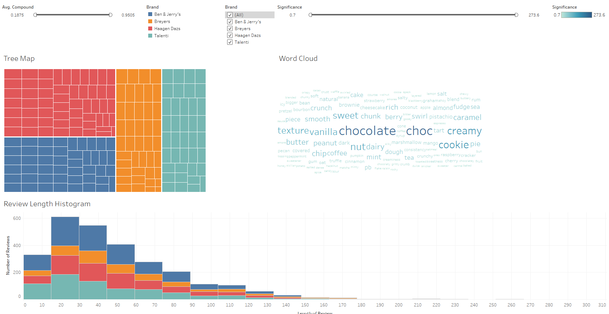

# UW_final_project
## Members: Brian Forth, Ashley Green, Max Thorstad, Kylie Wrenn

### Communication Protocols
For the duration of this project, Slack will be our primary communication vehicle. We've created a group chat there and so far it has proven sufficient to get feedback from one another and brainstorm.

We also have a standing weekly meeting at 7pm CST every Wednesday via Zoom, in addition to utilizing weekly class time to strategize next steps and perform our analysis.

### Presentation

We selected this topic to determine what ice cream flavor would be the best for our new ice cream company. For our new flavor, we want a specialty flavor. Our source data is several csv files from Kaggle that compiled flavors and customer reviews from four different ice cream companies. The flavor dataset includes the company, name of the flavor, and a description. The review dataset includes a product rating from 1-5, votes on whether or not other customers found each review helpful, and a written-out review. We will use Natural Language Processing (NLP) to parse out the written reviews in order to determine which words are most associated with higher ratings so we can better determine a flavor for our specialty ice cream. We're going to use this process to maximize efficiency in our product development process.

[Google Slides Presentation](https://docs.google.com/presentation/d/1o12XOvr3tCzIAZenm0lMi9tgW_xn3FhA8FbdcHNaUy4/edit#slide=id.gdc1ec10833_0_77)

We selected this topic to determine what ice cream flavor would be the best for our new ice cream company. For our new flavor, we want a specialty flavor. Our source data is several csv files from Kaggle that compiled flavors and customer reviews from four different ice cream companies. The flavor dataset includes the company, name of the flavor, and a description. The review dataset includes an overall product rating from 1-5, votes on whether or not other customers found each review helpful, and a written-out review that includes an individual consumer star rating of their product experience ranging from 1-5. 

We will use Natural Language Processing (NLP) to parse out the written reviews in order to determine which words are most associated with higher ratings so we can better determine a flavor for our specialty ice cream. This process will help us finalize our decision on a new specialty flavor and maximize efficiency in our product development process.

### Tableau Dashboard

[Tableau Dashboard]
(https://public.tableau.com/app/profile/brian.william.forth/viz/UW_final_project/IceCreamDashboard)



We created a Tableau Dashboard on the Tableau Public server in order to clearly illustrate some results we found in an interactive way that allows the viewer to filter to relevant data. The tree map and histogram can both be filtered by brand. The word cloud can be filtered by significance of the words. The tree map can be filtered by the average compund score from VADER for each flavor. Further, selecting either flavors from the Tree Map or bins of reviews in the histogram will filter the other visualization based on the selected data.


## Text Data Pre-Processing
### Natural Language Processing (NLP)

NLP is the process of converting normal language to a machine readable format, which allows a computer to analyze text as if it were numerical data.  

### Information Extraction & Text Classification


The primary goal of the nlp_feature_extraction_vectorizing.ipynb notebook is to pre-process large amounts of text data in order to prepare it for an NLP model that extract information and classifies text. 

- Extracting information: Many NLP tasks require the ability to retrieve specific pieces of information from a given document. We want to extract certain aspects of the review text data to present a compelling case for our speciality flavor.

- Classifying text: For many of the aforementioned use cases to work, a computer must know how to classify a given piece of text. We will classify our "Bag of Words" by positive and negative sentiment. 


### Scope of the notebook:
source: nlp_feature_extraction_vectorizing.ipynb


#### 1.  Data Inspection
#### 2.  Add Sentiment Feature to data set
#### 3.  Create Product Sentiment Reviews Dataset


For the README, we are only covering the first 3 steps due to custom stopword updates re-tokenizing the text data. Those steps will be covered as we go over the "Feature Engineering."


<br>
<br>


***1.  Data Inspection***

We are starting with a review dataset ("Resources/helpful_clean_reviews_combined.csv") that has been filtered down to ice cream products that have achieved an overall amazon rating of 4 stars or higher, joined on the "key" with consumer reviews that have been filtered down to those that received more helpful_yes votes than helpful_no votes.


Knowing the data is key to ensuring its compatible with any functions or methods required for the code to perform.
We know, off the cusp, that we have to teach the computer how to understand natural language by encoding text to numerical data that it can be taught to interpret.  

So lets pull out our pen and paper to note what data must be transformed.


It doesn't like strings or null values so lets identify any of those. 


Also, we will remove any duplicate data as it doesn't tell us anything new and may skew results. 


We can drop these duplicates now before our pre-processing begins. Note: Duplicates were already dropped, hence 0 count. There were originally 4 duplicated reviews. 


<br>
<br>

***2.  Add Sentiment Feature to data set***

Here we assign a value of 1 to reflect positive sentiment. This consists of star rating greater than or equal to 4. Any review with a star rating less than 4 gets a value of 0 to reflect negative sentiment. Remember, star rating is the rating left by the individual reviewer. It is different than the overall rating presented by Amazon.


Number of positive reviews: 2,739
Number of negative reviews: 685

<br>
<br>


***3.  Create Product Sentiment Reviews Dataset***

location: "Resources/product_sentiment_reviews.csv"


<br>
<br>


## Feature Engineering
### Natural Language Processing (NLP)


### Scope of this notebook:


### 1.  Tokenization, Normalization & Custom Stopword Filtering with NLTK
### 2.  Extract the most common words
### 3.  Create "Bag of Words" data set
### 4.  Term Frequency-Inverse Document Frequency (TF-IDF)
### 5.  Split the Data into Training and Testing
### 6.  Balanced Random Forest Classifier


***1.  Tokenization, Normalization & Custom Stopword Filtering***

We begin by creating a DataFrame, df_tokenize, with the product_sentiment_reviews table created in step 3 of Text Data Pre-processing. 
(location: "Resources/product_sentiment_reviews.csv")


Next, all the magic of splitting the reviews into individual words, putting each word into lower case, lemmatizing each to its base form, removing punctuations and excluding a custom list of stopwords occurs.

We perform this step with the NLTK library as it is the most popular in education and research for NLP.  

Here are the dependencies:

```
# import the Tokenizer library
import nltk
from nltk.tokenize import word_tokenize, RegexpTokenizer

# RegexpTokenizer will tokenize according to any regular expression assigned. 
# The regular expression r'\w+' matches any pattern consisting of one or more consecutive letters.
reTokenizer = RegexpTokenizer(r'\w+')


from nltk.corpus import stopwords
from string import punctuation

# Create Custom Stopwords 
stop_words = set(stopwords.words('english'))
stop_words.update(list(set(['10','100','15', '20', '2in1', '30', '50', 'able', 'absolute', 'actual', 'actually', 'add', 
                            'added', 'adding', 'addition', 'ago', 'allergic', 'allergy', 'alternative', 'area', 'ask', 
                            'ate', 'available', 'away', 'awesome', 'balance', 'bar', 'barely', 'bark', 'base', 'based', 
                            'basically', 'batch', 'beat', 'belgian', 'ben', 'birthday', 'bit', 'bite', 'black', 'bought', 
                            'bowl', 'box', 'boy', 'boyfriend', 'brand', 'break', 'breyers', 'bring', 'brought', 'brown', 
                            'bryers', 'bud', 'buy', 'buying', 'called', 'calorie', 'came', 'carb', 'carbs', 'care', 'carry',
                            'carrying', 'carton', 'case', 'cause', 'ccc', 'center', 'certainly', 'chance', 'change', 
                            'changed', 'cheap', 'check', 'child', 'chocoholic', 'choice', 'choose', 'christmas', 'chubby',
                            'chuck', 'close', 'cold', 'color', 'com', 'combo', 'come', 'coming', 'company', 'completely', 
                            'consider', 'consumer', 'contact', 'contained', 'container', 'contains', 'continue', 'cool', 
                            'cost', 'couple', 'coupon', 'cow', 'craving', 'cream', 'create', 'created', 'creation', 'cup', 
                            'customer', 'cut', 'daily', 'daughter', 'day', 'daz', 'dazs', 'deal', 'decade', 'decided', 
                            'deep', 'definitely', 'desert', 'dessert', 'diabetic', 'didnt', 'die', 'diet', 'dig', 'dinner',
                            'directly', 'discontinue', 'discontinued', 'dont', 'double', 'drive', 'earth', 'easily', 'easy',
                            'eat', 'eaten', 'eating', 'edition', 'email', 'end', 'ended', 'entire', 'expect', 'eye', 'fact',
                            'fall', 'family', 'fan', 'far', 'fat', 'filled', 'finally', 'finding', 'fine', 'fish', 'fix', 'flavor',
                            'food', 'forever', 'formula', 'forward', 'free', 'freezer', 'fresh', 'friend', 'frozen', 
                            'future', 'gallon', 'garcia', 'gave', 'gelato', 'gelatos', 'getting', 'gimme', 'giving', 'glad',
                            'gluten', 'god', 'going', 'gone', 'gonna', 'good', 'got', 'gotten', 'grab', 'gram', 'green', 
                            'grocer', 'grocery', 'guess', 'guilty', 'guy', 'haagen', 'half', 'halo', 'hand', 'happen', 
                            'happened', 'happy', 'hard', 'hardly', 'hate', 'havent', 'hd', 'healthy', 'hear', 'heard', 
                            'heart', 'help', 'high', 'highly', 'hill', 'hint', 'hit', 'holiday','home','homemade','honest',
                            'honestly', 'hot', 'house', 'hubby', 'huge', 'husband', 'häagen', 'ice', 'icecream', 'id', 
                            'idea', 'ill', 'im', 'imagine', 'influenster', 'inside', 'instead', 'irish', 'isnt', 'issue', 
                            'italy', 'item', 'ive', 'jar', 'jerry', 'job', 'kept', 'keto', 'kid', 'kind', 'kinda', 'knew', 
                            'know', 'label', 'large', 'larger', 'late', 'lately', 'later', 'layer', 'le', 'leave', 'left', 
                            'let', 'level', 'lid', 'life', 'light', 'like', 'liked', 'limited', 'line', 'list', 'literally',
                            'little', 'live', 'local', 'lol', 'long', 'longer', 'look', 'looked', 'looking', 'lost', 'lot',
                            'love', 'loved', 'lover', 'low', 'lower', 'luck', 'major', 'make', 'making', 'man', 'market', 
                            'maybe', 'mean', 'mediterranean', 'mess', 'middle', 'mild', 'mile', 'mind', 'mini', 'minute', 
                            'miss', 'mom', 'money', 'monkey', 'month', 'mouth', 'multiple', 'near', 'need', 'needed', 
                            'needle', 'net', 'new', 'nice', 'night', 'non', 'normal', 'normally', 'note', 'notice', 
                            'noticed', 'number', 'offer', 'oh', 'oil', 'ok', 'okay', 'old', 'omg', 'one', 'open', 'opened', 'option', 
                            'order', 'original', 'outside', 'overall', 'overly', 'pack', 'package', 'packaging', 'pair', 
                            'paired', 'particular', 'party', 'past', 'pay', 'people', 'period', 'permanent', 'person', 'phish',
                            'pick', 'picked', 'picture', 'pint', 'place', 'plain', 'planet', 'plus', 'point', 'portion', 
                            'possible', 'prefer', 'pregnant', 'premium', 'pretty', 'previous', 'probably', 'problem', 'product',
                            'protein', 'publix', 'purchase', 'purchased', 'purchasing', 'pure', 'purpose', 'quart', 'quickly', 
                            'quite', 'rating', 'ratio', 'reach', 'read', 'reading', 'real', 'really', 'reason', 'received', 
                            'recent', 'recently', 'recipe', 'regular', 'remember', 'reminds', 'remove', 'replaced', 'rest', 
                            'return', 'review', 'reviewer', 'ribbon', 'rid', 'right', 'road', 'rock', 'round', 'ruby', 'run',
                            'said', 'sale', 'save', 'saw', 'say', 'saying', 'scoop', 'season', 'seasonal', 'second', 
                            'section', 'seeing', 'seen', 'sell', 'selling', 'sent', 'seriously', 'service', 'serving', 'share',
                            'sharing', 'shelf', 'shop', 'shopping', 'short', 'sick', 'similar', 'simple', 'simply', 'single',
                            'sit', 'sitting', 'size', 'slightly', 'small', 'smaller', 'smart', 'snack', 'sold', 'son', 'soon',
                            'sooo', 'soooo', 'sorbet', 'sorbetto', 'sorry', 'sort', 'sound', 'spirit', 'spoon', 'spoonful', 
                            'spot', 'stand', 'star', 'start', 'started', 'state', 'stay', 'stick', 'stock', 'stop', 'stopped',
                            'store', 'straight', 'stuff', 'substitute', 'summer', 'super', 'supermarket', 'sure', 'taken', 
                            'taking', 'talenti', 'target', 'team', 'tell', 'thats', 'therapy', 'theyre', 'thing', 'think', 
                            'thinking', 'thought', 'time', 'tiny', 'today', 'told', 'ton', 'tongue', 'tonight', 'took', 'tooth',
                            'total', 'totally', 'touch', 'treat', 'trio', 'trip', 'true', 'truly', 'try', 'trying', 'tub', 
                            'turn', 'turned', 'twice', 'type', 'typically', 'understand', 'unilever', 'unless', 'unlike', 'use',
                            'used', 'using', 'usual', 'usually', 'variety', 'version', 'wait', 'waiting', 'walmart', 'warm', 
                            'wasnt', 'water', 'way', 'website', 'week', 'weight', 'went', 'weve', 'whats', 'whim', 'white', 
                            'wife', 'word', 'work', 'world', 'worth', 'wouldnt', 'write', 'year', 'yes', 'yesterday', 'york', 
                            'youll', 'youre', 'youve'
])))


from nltk.stem import WordNetLemmatizer
lemmatizer = WordNetLemmatizer()

from nltk import FreqDist
```


Next we define our feature targets.  Our feature targets are all of the recipe and texture related words manually selected after going through the 1,000 most common words one by one. 

```
# Define features
custom_words =  set(['bigger', 'almond', 'apple', 'banana', 'bean', 'berry', 'bitter', 'blackberry', 'bourbon',
                          'brownie', 'bun', 'butter', 'buttery', 'cacao', 'cake', 'candy', 'caramel', 'carmel', 'cheesecake', 
                           'cherry', 'chip', 'choc', 'chocolate', 'chocolatey', 'chocolaty', 'cinnamon', 'cocoa', 
                          'coconut', 'coffee', 'cone', 'cookie', 'cooky', 'cracker', 'crust', 'dairy', 'dough', 
                          'dulce', 'espresso', 'flake', 'fruit', 'fudge', 'graham', 
                          'hazelnut', 'honey', 'lemon', 'mango', 'marshmallow', 'matcha',  'mint', 'minty', 'nut', 'oat', 
                          'oatmeal', 'oreo', 'pb', 'peanut', 'pecan', 'peppermint', 
                          'pie', 'pistachio', 'potato', 'pretzel', 'pumpkin', 'raisin', 'raspberry', 'rum', 'salt', 'salted',
                          'salty', 'smore', 'smores', 'snicker', 'sour', 'spice', 'strawberry',  
                          'sweet', 'sweetener', 'sweeter', 'sweetness', 'swirl', 'swirled', 'syrup', 'tart', 'tea', 
                          'toasted', 'toffee', 'truffle', 'turkey', 'vanilla', 'waffle', 'walnut',
                          'natural', 'sauce', 'sea', 'sicilian', 'ahoy', 'blend', 'blended', 'covered', 'dark', 'baked', 
                          'course', 'layered', 'piece', 'rocky', 'silky', 'speck', 'topping', 'chewy', 'chunk', 'chunky', 'consistency',
                          'creaminess', 'creamy', 'crispy', 'crumb', 'crunch', 'crunchy', 'dense', 'gooey', 'gritty', 'gum', 'icy', 
                          'rich', 'smooth', 'soft', 'texture'])
```


Then we extract each individual feature from every review into a list called "text_custom", with special attention to filter out our custom stopwords.
Note: There are comments within the code to explain each line's purpose.

``` 
for i in range(len(df_tokenize['text'])):
       
    
    df_tokenize['text_custom'][i] = []
    
    # iterate through tokens
    for word in custom_words:
        if word in df_tokenize['text'][i]:
            
            if word not in stop_words:
            
        
                # append to text column of dataframe for appropriate row
                df_tokenize['text_custom'][i].append(word)

# convert text list to string and create string column
df_tokenize['text_custom_str'] = df_tokenize['text_custom'].apply(lambda x: ','.join(map(str, x)))


# collect all the words from all the reviews into one list

# initialize list to hold words
all_words = []


for i in range(len(df_tokenize['text'])):
    # separate review text into a list of words
    tokens = reTokenizer.tokenize(df_tokenize['text'][i])
    
    
    df_tokenize['text'][i] = []
    
    # iterate through tokens
    for word in tokens:
        # lower the case of each word
        word = word.lower()
        # exclude stop words
        if word not in stop_words:
            
            # Lemmatize words into a standard form and avoid counting the same word more than once
            word = lemmatizer.lemmatize(word)
            # add to list of words
            all_words.append(word)
            # append to text column of dataframe for appropriate row
            df_tokenize['text'][i].append(word)
```

The model has extracted each individual word from the review text in a list called "all_words," which holds 5801 unique words total.


<br>
<br>

***2.  Extract the most common words***

Next, we extract our "Bag of Words," also known as "Most Common Words."
We are starting with 500 words to get an idea of the type of words we should normalize and filter out at with advanced feature exaction.

```
# Extract the most common words from the list of all_words.

from nltk import FreqDist

# sort all of the words in the all_words list by frequency count
all_words = FreqDist(all_words)
# Extract the most common words from the all_words list
most_common_words = all_words.most_common(500)

# create a list of most common words without the frequency count
word_features = []
for w in most_common_words:
    word_features.append(w[0])

#print 
most_common_words
```

There are  500 unique words in the most common words list.
<br>


<br>
<br>

***3.  Create "Bag of Words" data set***

Now that the model has extracted the Bag of Words, we add the most common words from each review as a new column called bag_of_words. 
The model will iterate through the list of word_features (same as most common words, excluding the frequency count) and append to the dataset. We create new list as a form of a checkpoint so not to overwrite any prior work we've done. This is important to maintain the integrity of the data since the computer doesn't automatically re-run all cells as we make changes to the code. 


```
# iterate dataframe to populate bag of words column
for i in range(len(df_bagofwords['text_custom'])):
    # initialize empty column    
    df_bagofwords['bag_of_words'][i] = []
    
    # iterate through df row by row
    for word in df_bagofwords['text_custom'][i]:
        # if a word in 'text' is in the most common words
        # note: this is simply the "most_common_words" without the count column
        if word in word_features:
            # if it is, add it to the bag of words cell
            df_bagofwords['bag_of_words'][i].append(word)

```


Here is an example showing the beauty of all our work so far. 


The model has extracted each individual word from the text, filtering out stopwords in the NLTK stopword library and our bag of words are limited to the 500 most common words.  There are still words that we would like to add to stopwords to create our custom stopwords, but for now we are happy to see the model is working as designed.


<br>
<br>


***4.  Term Frequency-Inverse Document Frequency (TF-IDF)***

Term Frequency-Inverse Document Frequency (TF-IDF) statistically ranks the words by importance compared to the rest of the words in the text. This is also when the words are converted from text to numbers.

Decision trees such as Random Forests are insensitive to monotone transformations of input features. Since multiplying by the same factor is a monotone transformation, TF-IDF is compatible with such models.  This is great as we are pre-processing for Random Forests, but the data is ready for other classifiers that may require TF-IDF as well. 

Let's take a look at the code to complete TF-IDF.

```
# import dependencies
from sklearn.feature_extraction.text import TfidfVectorizer

# create new DataFrame to hold encoded values 
df_tfidf_text = pd.DataFrame(df_bagofwords)

# convert text list to string and create string column
# Required for vectorizer. Running on a list will yield an error.
# https://stackoverflow.com/questions/45306988/column-of-lists-convert-list-to-string-as-a-new-column
df_tfidf_text['bag_of_words_str'] = df_tfidf_text['bag_of_words'].apply(lambda x: ','.join(map(str, x)))

```


Our bag of words are now in string format, enabling the TfidVectorizer to analyze each individual word.


The TfidVectorizer now analyzes each individual word in our bag of words, filters out stop words via stemming. We allow this with tfidf as it groups all words which are derived from the same stem (i.e. delayed, delay), this grouping will increase the occurrence of this stem because frequencies are calculated using stem not words. It appears to perform better than the NLTK stopwords library, which again, we will investigate futher when training the model to achieve desired accuracy. 


```
# get 'text' term frequencies weighted by their relative importance (IDF)
tfidf = TfidfVectorizer(analyzer='word', stop_words = 'english')

# create variable to hold independent features and TFIDF
x = df_tfidf_text['bag_of_words_str']


# Fit and transform independent features
xtfidf = tfidf.fit_transform(x)

# Create encoded TFIDF vector for bag of words
tfdif_bagOfWords_df = pd.DataFrame(data = xtfidf.toarray(),
                        # set column header as feature names           
                        columns = tfidf.get_feature_names())
                        
# Rank top 20 terms from TFID in order of signifigance score
terms = tfidf.get_feature_names()

# sum tfidf frequency of each term through documents
sums = xtfidf.sum(axis=0)

# connecting term to its sums frequency
data = []
for col, term in enumerate(terms):
    data.append( (term, sums[0,col] ))

ranking = pd.DataFrame(data, columns=['term','rank'])
term_rank = ranking.sort_values('rank', ascending=False)

term_rank[:20]                        

```

Here are the top 20 features, statistically ranked by importance.


Next, we merge the encoded TFIDF vector we created for our bag of words with the original columns we'd like to keep. 


<br>
<br>

***5.  Split the Data into Training and Testing***

Here we define our training and testing data in preparation for the Random Forest Classifier model. 

As highlighted before, we have 127 features in our custom_words list. We selected these as our features to capture how well the model predicts sentiment based on customer reviews that mention anything related to recipe or texture. For the sake of this analysis, recipe consists of ingredients such as fruits or nuts, and, flavors such as vanilla or mint.  Texture would be any words such as crunch or chunky. 


Sentiment is our target variable, "y." 

X represents our features, which is everything from the merged dataframe after we drop the following columns: "key","stars","helpful_yes","helpful_no","rating","sentiment."  These values add no value to sentiment, so we exclude them. 

```
# Segment the features from the target
y = df_tfidf_text["sentiment"]
X = df_tfidf_text.drop(["key","stars","helpful_yes","helpful_no","rating","sentiment"], axis=1)
```

After segmenting features from the target, we train, test and split the data at 75% with sklearn's train_test_split.


<br>
<br>

***6.  Balanced Random Forest Classifier***

For this project we decided to go with a Random Forest model (RF) for our classifier. There were several reasons we chose this over other models. First, an RF model is not as prone to overfitting the data as a Decision Tree and we thought that was a risk with this dataset. Also, RF models can handle a large number of features and we have 127. However, with a RF, we are limited with regression, but that is not as important with this dataset which is another reason why we chose this model. Lastly, RF can be used to rank the importance of input variables in a natural way and can handle thousands of input variables without variable deletion.


The RF Model produces an Accuracy Score, Confusion Matrix and a Classification Report that highlights preciscion, recall and F1 scores. 

Accuracy Score<br>
<br>
Confusion Matrix<br>
<br>
Classification Report<br>
<br>


It also produces Top 10 Features Ranked by Importance.


## VADER Sentiment Analysis

When preparing our data for our analysis, we chose to exclude products with an overall Amazon rating less than 4.  This was to focus on the best products as we are hoping to identify the best specialty flavor to expand our business.  As a result, we were unable to achieve an acceptable accuracy score.  There simply isn't enough "negative sentiment" within the dataset to train the model in a way that it will accurately predict negative sentiment. 

To dive further, we designed a VADER Sentiment analysis model in hopes to gain more insight. 


VADER produced a compound sentiment score for each review, which is great as we then had an unbiased score to compare against our formula of assuming all individual consumer star ratings of 4 or higher were positive. VADER scores from -1 to 1, with anything greater than 0 considered positive.

Positive reviews are what we want as we hope the reviews will aide in identifying a new specialty flavor. The VADER Sentiment Analyzer agrees with our formula for positive sentiment 93% of the time. That is GREAT!

In theory, we should be able to calculate the average "compound value" for each key, followed by ranking the top 10 to see which products achieved the highest sentiment based on text alone.

So lets see...


We now have VADER Top 20 Ice Cream Flavors.


## Results

After lots of analysis, we have decided to go with Mint Chocolate Chip as our specialty flavor.  From our work, we have learned we must allow room in our data for negative sentiment to have a fully trained model.  Fortunately, our precision score for predicting positive sentiment is 0.85 which meets our goal at this time.

We are very comfortable with VADER's compound score of 0.95 for Mint Chocolate Chip
